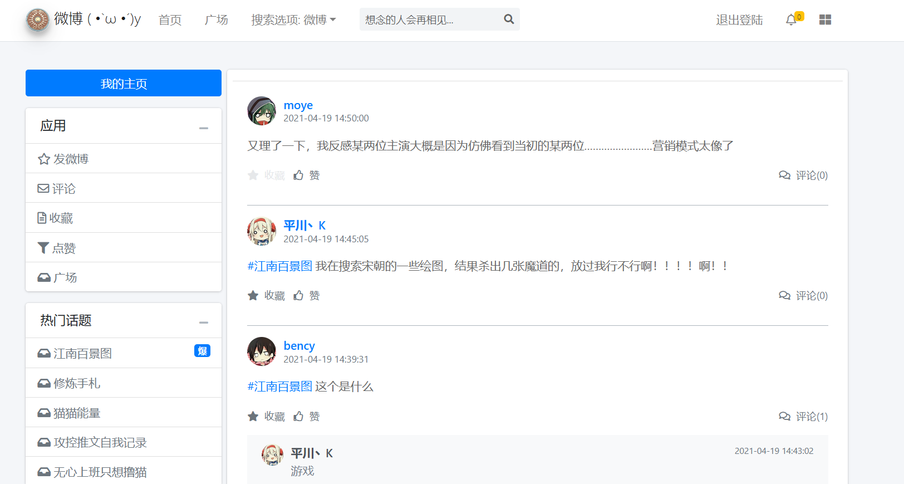
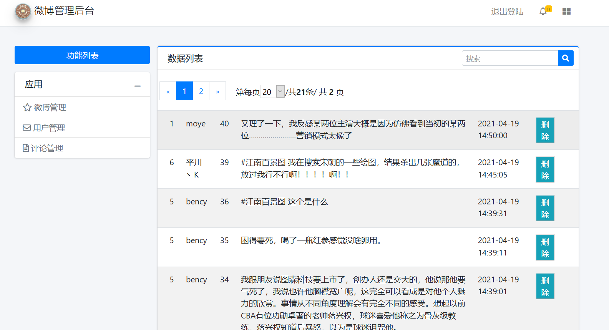
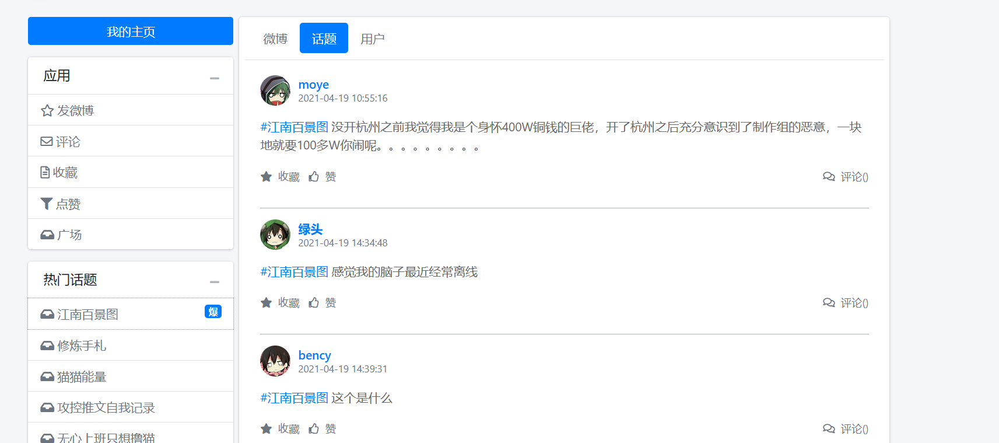
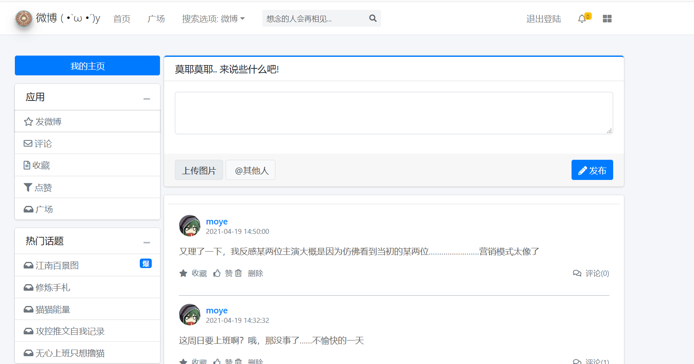
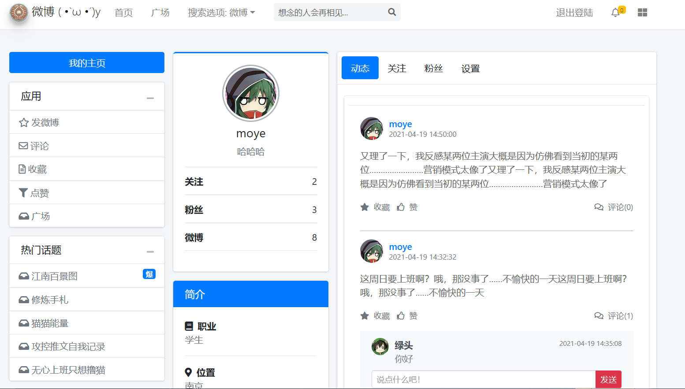
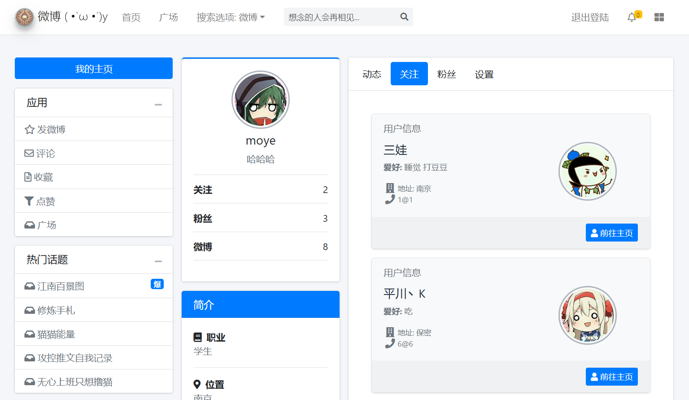
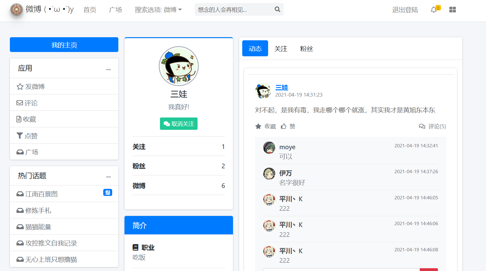

# moye_weibo
莫耶微博 
基于SpringBoot实现微博系统。
> 迫于给女朋友写论文, 开工这个微博系统。

因为时间关系, 基本上是最快速度写(糊)出来的, 论文原文迫于她本人意愿无法开源。
构架是 SpringBoot 加 SpringDataJPA 加 SpringSecurity 实现(Spring全家桶)。

# 前端是: angularJs 和 AdminLTE3.1 模板 

前端参考了
> angularJs: https://docs.angularjs.org/api

> AdminLTE3.1: https://adminlte.io

> AdminLTE3.1 汉化:  https://3vshej.cn/AdminLTE/AdminLTE-3.x/index3.html

> Bootstrap4 https://getbootstrap.net/docs/components/dropdowns/

# 数据库
MySQL  建表测试SQL见根目录  
> weibo_test.sql

# 页面
> 首页 http://localhsot:8080

> 管理员 http://localhsot:8080/admin
> 

# 页面展示
> 
> 
> 
> 
> 
